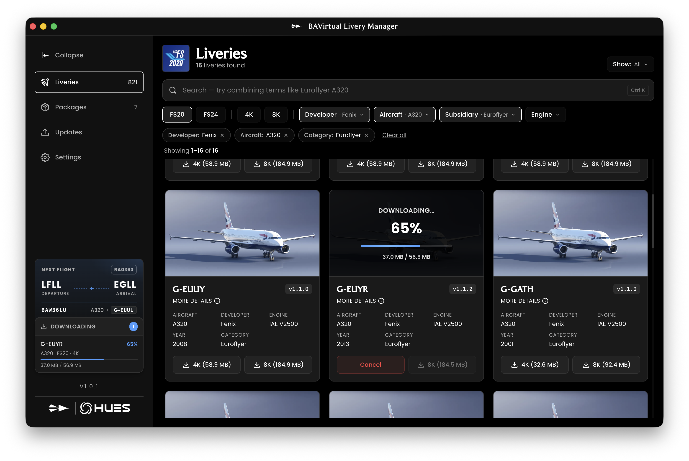

# BAVirtual Livery Manager

A desktop utility that helps **BAVirtual (British Airways Virtual)** pilots install, update, and manage aircraft liveries in a few clicks.




## ✨ Features

- **One-click installs** for the full BAVirtual livery catalog into MSFS 2020 and MSFS 2024
- **4K / 8K variants** — choose the resolution per livery
- **Smart search & filters** by aircraft, developer, subsidiary, engine, resolution, year, and installed state
- **Required packages** (SpeedCore, sound packs, and other addons) are detected and installed automatically alongside compatible liveries
- **Update notifications** — outdated liveries and packages are flagged in the sidebar and updated in one click
- **Next Flight integration** — see your booked BAVirtual flight in the sidebar and jump straight to the right livery
- **Dark & light themes**
- **Auto-updating** — new versions install themselves from GitHub releases
- Lightweight Electron UI built with React + TypeScript

## 📦 Installation

> Distributed only for **Windows (x64)** as the Manager supports only MSFS2020 and MSFS2024.

1. Go to the **[Releases](https://github.com/p-sergienko/bav-livery-manager/releases)** page.
2. Download the latest `BAV-Livery-Manager-x.y.z-Setup.exe`.
3. Run the installer and launch the app.
4. Sign in with your BAVirtual credentials.

Future versions install themselves automatically, so you only need to do this once.

## 🧱 Built with

- [Electron](https://www.electronjs.org/) + [Vite](https://vitejs.dev/)
- [React 19](https://react.dev/) + [TypeScript](https://www.typescriptlang.org/)
- [TanStack Query](https://tanstack.com/query), [Zustand](https://zustand-demo.pmnd.rs/), [React Router](https://reactrouter.com/)
- [Bun](https://bun.sh/) as the package manager


## 🧑‍💻 Development

```bash
# install dependencies
bun install

# run the app with hot reload (renderer + Electron main)
bun run dev

# build the production bundle
bun run build

# produce a Windows installer in ./release
bun run build:exe
```

The renderer dev server runs on `http://localhost:5173`; Electron picks it up once the main-process TypeScript has compiled.

## 🐛 Reporting issues

Bugs and feature requests live on **[GitHub Issues](https://github.com/p-sergienko/bav-livery-manager/issues)**.

For livery-specific support (broken textures, missing aircraft, etc.), please raise a ticket via the **[BAV Support System](https://support.bavirtual.co.uk/)**.

## 📄 License

Released under the **[MIT License](./LICENSE)** © 2025 Pavel Sergienko.

Built by **Pavel Sergienko** and **Laurie Cooper** for the BAVirtual community.
